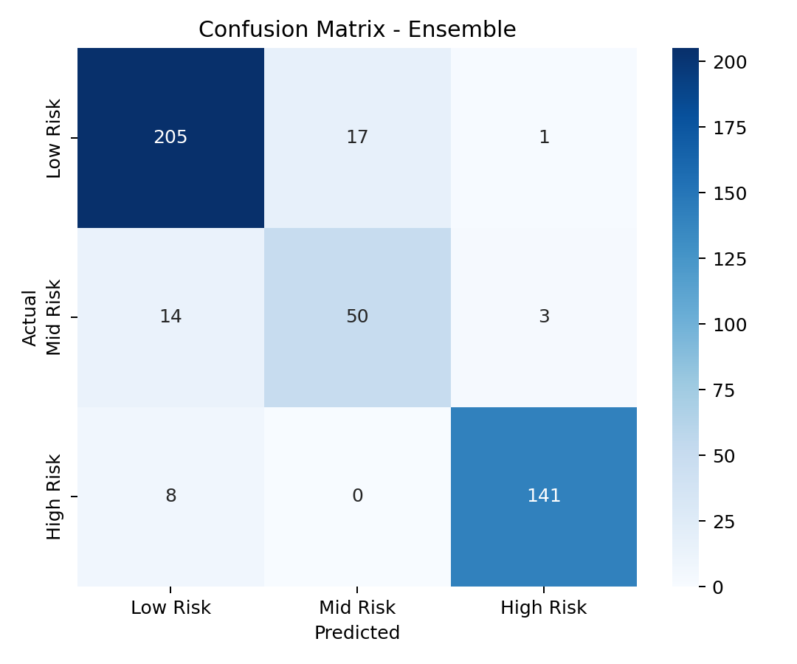
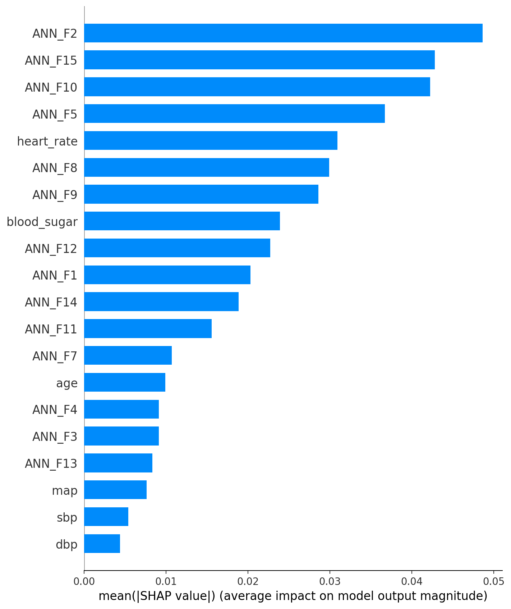

# MaternaGuard Accuracy Report

## 1. Dataset summary
- DS1 + DS2 + DS3 inspection saved in docs/dataset_inspection.json
- DS1 shape: [1014, 7]
- DS2 shape: [1205, 12]
- DS3 shape: [999, 28]
- Class distribution before SMOTE (train split): {0: 892, 1: 269, 2: 595}
- Class distribution after SMOTE (train split): {0: 892, 1: 971, 2: 894}

## 2. Feature list (11 total)
- age
- sbp
- dbp
- blood_sugar
- body_temp
- heart_rate
- pulse_pressure
- map
- hyperglycemia_flag
- age_band
- bp_severity

## 3. Results table
| Model | Accuracy | Macro F1 | High Risk Recall |
|---|---:|---:|---:|
| Random Forest | 0.8155 | 0.7866 | 0.8658 |
| Gradient Boosting | 0.7790 | 0.7486 | 0.8121 |
| XGBoost | 0.8360 | 0.8009 | 0.9128 |
| ANN | 0.6629 | 0.6275 | 0.7450 |
| Ensemble (All 4) | 0.9021 | 0.8722 | 0.9463 |
| Published benchmark (Togunwa 2023) | 0.9500 | 0.9700 | N/A |

## 4. Confusion matrix image

## 5. SHAP importance chart image

## 6. Key finding
High Risk recall of 0.9463 means we correctly flag 94.63% of truly dangerous pregnancies, the clinically critical metric.
